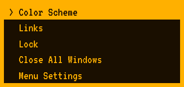
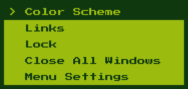
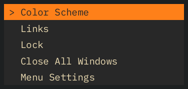

# KOHA (Kwik One-Hotkey Access)

Popup menu kecil seperti [rofi](https://github.com/davatorium/rofi) untuk desktop: kamu
menekan satu tombol, memilih satu aksi dengan keyboard, dan selesai. KOHA menampilkan
menu, menjalankan aksi yang dipilih, lalu **keluar**. Tidak ada proses yang tertinggal di
background dan tidak ada pendengar hotkey global, sehingga tidak membebani laptop.

Ini penulisan ulang dari KOHA versi AutoHotkey, dalam Rust, dengan menu yang diatur lewat
berkas config (bukan tertanam di kode).

| `amber` | `game_boy` | `gruvbox` |
|---|---|---|
|  |  |  |

Tujuh tema bawaan, dan setiap tema membawa fontnya sendiri (font bergaya retro untuk
`game_boy`, `amber`, dan `green_term`).

## Status

**Versi 0.1.0, hanya Windows.** Dikembangkan dan diuji di Windows 11. Linux dan macOS belum
didukung (lihat [docs/platforms.md](docs/platforms.md) untuk keadaan sebenarnya dan di mana
melanjutkannya). Belum ada instalator atau binary siap unduh: KOHA dibangun dari sumber.

## Membangun

Yang dibutuhkan:

- [Rust](https://rustup.rs) stabil. Dikembangkan dengan Rust 1.99; proyek memakai edition 2024
  yang membutuhkan Rust 1.85 atau lebih baru (versi minimum sebenarnya belum diuji).
- **Visual Studio Build Tools** dengan komponen "Desktop development with C++" (kompiler MSVC
  dan Windows SDK). Tanpa ini, Rust gagal di tahap *link* dengan pesan seperti
  `cannot open file 'msvcrt.lib'`.

```powershell
git clone https://github.com/zakiburnama/GUI-KOHA_Rust.git
cd GUI-KOHA_Rust
cargo build --release
```

Hasilnya satu berkas mandiri: `target\release\koha.exe` (sekitar 1,5 MB). Font sudah tertanam
di dalamnya dan tidak ada yang perlu dipasang. Build rilis memakai LTO sehingga makan sekitar
satu setengah menit. Salin `koha.exe` ke mana pun kamu mau.

## Mulai

```powershell
.\target\release\koha.exe
```

KOHA langsung berjalan dengan menu contoh bawaan, tanpa berkas apa pun. Untuk menyusun menumu
sendiri:

```powershell
.\target\release\koha.exe --init      # tulis config contoh ke %APPDATA%\koha\config.toml
notepad $env:APPDATA\koha\config.toml
```

Contoh config paling sederhana:

```toml
version = 1

[[menu]]
id = "github"
label = "GitHub"
type = "url"
url = "https://github.com"

[[menu]]
id = "kunci"
label = "Lock"
type = "builtin"
name = "lock"
```

Referensi lengkap (tipe item, aksi bawaan, submenu, tema, font, state, dan pesan error) ada
di [docs/configuration.md](docs/configuration.md).

### Tombol

| Tombol | Fungsi |
|---|---|
| `↑` / `Shift+Tab` | Baris sebelumnya (melingkar) |
| `↓` / `Tab` | Baris berikutnya (melingkar) |
| `Enter` | Pilih: buka submenu atau jalankan aksi |
| `Esc` | Kembali satu tingkat; di menu utama, tutup |
| Tombol lain, atau klik di luar jendela | Tutup tanpa menjalankan apa pun |

`Shift` sendirian diabaikan (ia ditekan sebelum `Tab`). Baris **Menu Settings** selalu ada di
akhir menu utama dan dipakai untuk menyembunyikan atau menampilkan item. Mouse tidak
dipakai: KOHA dirancang untuk keyboard.

### Opsi baris perintah

| Opsi | Fungsi |
|---|---|
| `--config <jalur>` | Pakai berkas config ini (menimpa `KOHA_CONFIG` dan lokasi standar) |
| `--state <jalur>` | Pakai berkas state ini (menimpa `KOHA_STATE` dan lokasi standar) |
| `--init` | Tulis config contoh bila belum ada (tidak pernah menimpa) |
| `--print-config-path` | Cetak lokasi config yang dipakai, lalu keluar |
| `--print-state-path` | Cetak lokasi state yang dipakai, lalu keluar |
| `-h`, `--help` | Bantuan |
| `-V`, `--version` | Versi |

Build rilis tidak punya jendela konsol. Saat dijalankan dari terminal, KOHA menempel ke
konsolnya supaya keluaran di atas terlihat; karena itu aplikasi GUI ini tidak ditunggu oleh
shell, dan prompt kadang muncul lebih dulu daripada keluarannya. Itu perilaku Windows.
Saat dipanggil dari tombol atau pintasan (tanpa konsol), error ditampilkan sebagai dialog.

Untuk menangkap keluarannya di skrip PowerShell, alirkan lewat `Out-String`:

```powershell
$config = (.\koha.exe --print-config-path | Out-String).Trim()
```

Tanpa pipa (misalnya `$config = (.\koha.exe --print-config-path)`), PowerShell tidak
menunggu aplikasi GUI dan hasilnya kosong.

## Memasangkan ke tombol (Lenovo Vantage)

KOHA tidak mendengarkan hotkey sendiri; ia dipanggil oleh sesuatu yang lain. Di laptop
Lenovo, tombol bisa diatur lewat Lenovo Vantage. Vantage hanya menampilkan aplikasi yang
terdaftar di Start Menu, jadi KOHA perlu dipasang lebih dulu. Skrip yang disediakan
melakukannya:

```powershell
cargo build --release              # bila belum (di paket rilis, koha.exe sudah ada)
.\tools\install-shortcut.ps1
```

Skrip ini menyalin `koha.exe` ke `%LOCALAPPDATA%\Programs\koha\` (supaya `cargo clean` atau
membangun ulang tidak merusak pintasan) dan membuat pintasan **KOHA (Rust)** di Start Menu.
Ia aman dijalankan berulang kali (memperbarui salinannya), menolak memasang build debug
(yang membuka jendela konsol; itulah yang dipakai `cargo run`), dan menolak menimpa pintasan
lain yang bernama sama, misalnya `KOHA` milik versi AutoHotkey, kecuali kamu memberi
`-Force`. Config dan state tidak disentuh. Opsi lain: `-Name` untuk nama pintasan, `-WhatIf`
untuk melihat apa yang akan dilakukan tanpa melakukannya, dan `-Uninstall` untuk menghapus.
Tidak butuh hak admin.

Setelah itu, uji dulu tanpa Vantage: tekan tombol Windows, ketik `KOHA (Rust)`, lalu Enter.
Lalu di Lenovo Vantage: **Device settings → Input → User defined key**, pilih tombolnya, atur
aksi ke **Open applications and files**, dan pilih **KOHA (Rust)** dari daftar.

> Langkah di Vantage disalin dari dokumentasi versi AutoHotkey dan **belum diuji dengan build
> Rust ini**; tampilan Vantage bisa berbeda antar versi. Skrip pemasangannya sudah diuji
> (semua skenario di folder percobaan, lalu pemasangan nyata dan peluncuran pintasannya lewat
> shell Windows), tetapi bukan dari tombol Vantage itu sendiri. Alat selain Vantage (misalnya
> AutoHotkey, PowerToys, atau pintasan keyboard Windows) juga bisa memanggil `koha.exe`.

## Keterbatasan yang diketahui

- **Hanya Windows.** Di Linux dan macOS kodenya terkompilasi dan tes unitnya lolos di CI,
  tetapi jendelanya belum pernah dijalankan di sana, dan semua aksi mengembalikan
  "belum didukung".
- **`sleep` tidak bekerja di PC Modern Standby tanpa hibernasi** (periksa dengan
  `powercfg /a`); API Windows yang dipakai dirancang untuk tidur klasik. Karena itu `sleep`
  tidak ada di config contoh.
- **Peluncuran pertama bisa lambat sekali.** Pada pengukuran, peluncuran pertama berkas
  `koha.exe` yang baru dibuat memakan 0,6 sampai 5 detik; peluncuran berikutnya sekitar 40 ms.
  Penyebabnya diduga pemindaian antivirus, belum dibuktikan. `koha.exe` tidak
  ditandatangani secara digital, jadi Windows SmartScreen bisa memperingatkan.
- **`close_all_windows` menutup jendela tempatmu bekerja juga**, termasuk terminal atau
  editor yang sedang terbuka (aplikasi dengan perubahan belum tersimpan biasanya menampilkan
  dialog dulu).
- **Tidak ada pencarian aplikasi.** Untuk membuka aplikasi, tulis item `exec` di config.
- **Karakter terbatas pada cakupan font** (Latin dan Latin-1, cukup untuk bahasa Indonesia).
  Aksara lain dan emoji tampil sebagai kotak. Teks yang lebih lebar dari 90% layar dipotong.
- Jendela selalu ditengahkan di **monitor utama**, bukan monitor tempat kursor berada.
- Config dibaca saat KOHA dijalankan; tidak ada muat-ulang otomatis.
- `fontdue`, pustaka rasterisasi font yang dipakai, bergantung pada `ttf-parser` yang
  ditandai tidak lagi dipelihara (RUSTSEC-2026-0192). Hanya tiga font yang kita tanam sendiri
  yang dibaca olehnya, jadi paparannya kecil; alasan lengkapnya ada di [deny.toml](deny.toml).

## Performa

Waktu start adalah fitur utama. Pada satu laptop, KOHA versi Rust terlihat sebagai jendela
dalam sekitar 34 ms (median) dibanding sekitar 68 ms untuk versi AutoHotkey, pada metrik
"jendela terlihat". **Jangan baca itu sebagai "dua kali lebih cepat"**: jendela Rust terlihat
sekitar 15 ms sebelum gambar pertamanya selesai, dan waktu AHK sampai tergambar tidak
diukur. Metode, tabel lengkap, dan keterbatasannya ada di
[docs/performance.md](docs/performance.md). Untuk mengukur sendiri:
[tools/README.md](tools/README.md).

## Struktur proyek

```text
crates/
  koha-core/      logika murni: config, menu (state machine), tema, state (tanpa panggilan OS)
  koha-platform/  trait Platform dan implementasi per OS (saat ini Windows)
  koha-gui/       jendela (winit + softbuffer), tata letak, render teks, font
  koha-app/       binary `koha`: CLI, lokasi berkas, merangkai semuanya
docs/             dokumentasi
tools/            skrip pengukuran dan pembuat daftar lisensi
```

Aturan dependensi: `koha-core` tidak bergantung ke crate lain; `koha-platform` dan `koha-gui`
bergantung ke `koha-core`; hanya `koha-app` yang mengenal semuanya. Panduan berkontribusi ada
di [CONTRIBUTING.md](CONTRIBUTING.md), dan riwayat perubahan di [CHANGELOG.md](CHANGELOG.md).
Cara kerja secara rinci ada di [docs/architecture.md](docs/architecture.md), dan urutan
pembangunannya di [docs/development-journey.md](docs/development-journey.md).

## Lisensi

**KOHA belum memiliki lisensi.** Artinya semua hak dilindungi penulisnya: kodenya bisa dibaca,
tetapi belum ada izin untuk menjalankan ulang, mengubah, atau membagikannya. Lisensi akan
ditentukan oleh penulis.

Komponen pihak ketiga yang ikut dalam binary memiliki lisensinya sendiri (kebanyakan MIT atau
Apache-2.0; tiga font berlisensi SIL Open Font License; satu pustaka MPL-2.0). Daftar
lengkapnya ada di [THIRD_PARTY_LICENSES.md](THIRD_PARTY_LICENSES.md).
